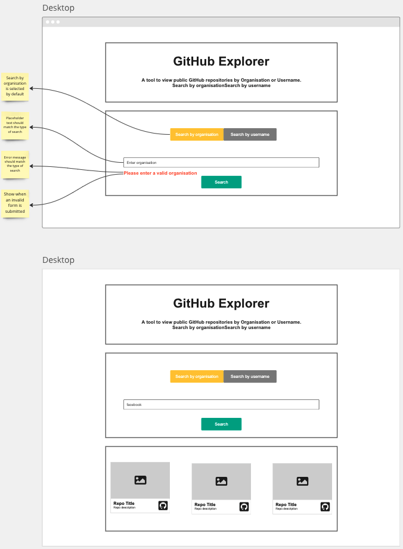
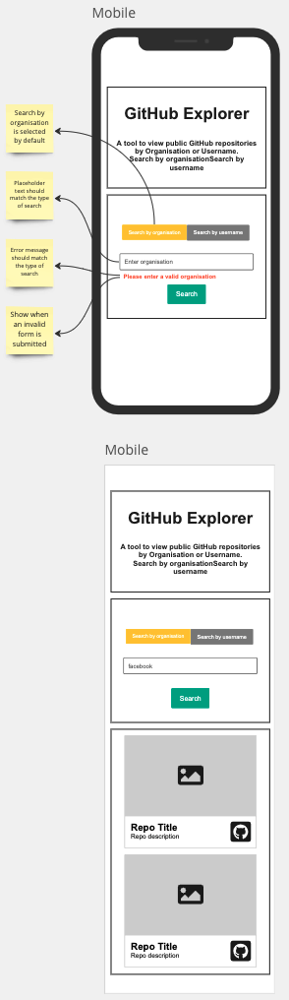

# GitHub Search Application

## User Story

As a user I should be able to search for information using the GitHub API.

## Acceptance Criteria

> User is presented with a form that has 2 buttons: `Search by organisation` and `Search by username`

> User is present with a text input to enter an organisation name or a username depending on which button they have clicked on

> When the user clicks on the `Submit` button the user is presented with a list of repositories

> When the user submit an empty form the user is presented with an error message "Please enter valid organisation" if the user has selected `Search by organisation`

> When the user submit an empty form the user is presented with an error message "Please enter valid username" if the user has selected `Search by username`

> Use the link `https://api.github.com/orgs/{organisationName}/repos` for a search by organisation name

> Use the link `https://api.github.com/users/{username}/repos` for a search by username name

> If user selects `Search by organisation` then the placeholder label should read "Enter organisation"

> If user selects `Search by username` then the placeholder label should read "Enter username"

> Repositories should be presented as many cards keeping in mind responsive layouts

> Each repository must be presented as a card with the following information: Repo name, Repo url, Description, User avatar

> If the number of repositories returned from the API is 0 then the user should be presented with an alert `"No repositories found."`

## Design Guide





## Getting Started

1. > Navigate to your `coding_bootcamp` workspace:

```
cd ~/coding_bootcamp
```

2. > Create a react project using the `create-react-app` script and use your own app name:

```
npx create-react-app your-app-name
cd your-react-app
```

3. > Create a repository in [GitHub](https://github.com/new) and enter the "Repository name" as the same name as your react app.

4. > In the terminal within your react app enter the commands provided by GitHub. The first command points your local repository to the remote GitHub, the second command sets your branch as `main` and the last command pushes all your local changes to the remote repository

```
git remote add origin git@github.com:YOUR_GITHUB_USERNAME/your-app-name.git
git branch -M main
git push -u origin main
```

5. > Once you refresh your GitHub page on the web browser you will see all your local files in GitHub.

6. > You can now proceed to work locally and add commit and push code regularly during development

## Resources

- CSS framework: [Bootstrap 5](https://getbootstrap.com/docs/5.3/getting-started/introduction/)
- Colour palette: [coolors](https://coolors.co/)
- Icons: [font-awesome icons](https://fontawesome.com/icons) | [CDN](https://cdnjs.com/libraries/font-awesome)
- [React docs](https://beta.reactjs.org/)
